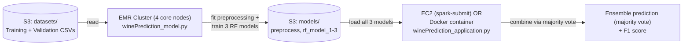

# Spark ML Wine Quality Prediction Pipeline

A parallel-trained machine learning pipeline on AWS: an ensemble of Spark MLlib RandomForest classifiers trained across a 4-node EMR cluster, served by a PySpark prediction application that runs identically bare-metal on EC2 or inside a Docker container.


## Overview

Built for NJIT CS643 (Cloud Computing), Programming Project 2: train a machine learning model in parallel across multiple cloud VMs, then package it so it can be deployed and run anywhere with one command.

**The problem:** predict a wine's quality score (1-10) from 11 physicochemical measurements (acidity, sugar, sulphates, alcohol, etc.), training the model across a distributed Spark cluster rather than a single machine, and packaging the trained model so it can be deployed consistently regardless of the host environment.

**The solution:** a Spark MLlib training job runs on a 4-core-node Amazon EMR cluster and fits an **ensemble of three independently-configured RandomForest classifiers** (different hyperparameters and random seeds) on a class-weighted, standardized version of the training data. A separate, lightweight prediction application loads all three trained models, runs inference on new data, and combines their outputs by **majority vote** (falling back to a rounded average when all three disagree). That same prediction application runs two ways: directly via `spark-submit` on an EC2 instance, or packaged into a Docker image that runs anywhere Docker does.

**Who this is for:** anyone evaluating applied ML-on-cloud skills — distributed model training with Spark MLlib, handling class imbalance, ensembling for more robust predictions, and containerizing an ML inference workload for portable deployment.

## Key Features

- **Distributed training on a 4-node EMR cluster** — the Spark training job (`winePrediction_model.py`) runs across the cluster's core nodes rather than on a single machine.
- **A 3-model RandomForest ensemble**, not a single classifier — three RandomForests with different `maxBins`/`minInstancesPerNode`/seed combinations are trained on the same data, and predictions are combined by majority vote (rounded average as a tiebreaker when all three disagree), for more robust predictions than any single model alone.
- **Class-weighted training** — wine quality scores are heavily imbalanced (most cluster around 5-6, very few at the extremes); each training example is weighted by the inverse frequency of its class (`total_count / count(label)`) so the model doesn't just learn to always predict the majority class.
- **A single, reusable preprocessing pipeline** (`VectorAssembler` + `StandardScaler`) fit once on the training data and applied identically to validation and test data — avoiding data leakage from fitting scalers on data the model will later be evaluated against.
- **The same prediction code runs two ways**: bare-metal via `spark-submit` on an EC2 instance, or containerized via Docker — no code changes between the two, only how it's invoked.
- **Dockerized deployment** — the trained model and inference code are packaged into a single container image that can be deployed to any Docker host without manually installing Java/Spark/Python dependencies each time.

## Demo / Results

A real evaluation run against the validation dataset:

```
Ensemble F1 score on test data: 0.5630
```

(see [`original-submission/screenshots/walkthrough/Img_12_EC2_F1Score.jpg`](original-submission/screenshots/walkthrough/Img_12_EC2_F1Score.jpg) for the captured console output). This is a 10-class classification problem (wine quality scores 1-10) with a naturally imbalanced label distribution, which is a meaningfully harder task than binary classification — see [`docs/architecture.md`](docs/architecture.md) for the per-model hyperparameters and the exact ensembling logic.

More screenshots from the original build/training process — including the EMR cluster setup, S3 layout, and Docker build steps — are under [`original-submission/screenshots/`](original-submission/screenshots/).

## Architecture



**Pipeline stages:**
1. Training and validation CSVs are uploaded to S3, alongside the training/prediction scripts.
2. An EMR cluster (4 core nodes, Spark) runs `winePrediction_model.py`: fits a shared preprocessing pipeline on the training data, computes class weights, trains 3 RandomForest classifiers with different hyperparameters, evaluates each on the validation set, and saves all 4 artifacts (preprocessing + 3 models) back to S3.
3. A separate EC2 instance (or a Docker container built from this repo) runs `winePrediction_application.py`: loads all 3 trained models plus the preprocessing pipeline, generates 3 predictions per row, and combines them via majority vote.
4. The application prints a sample of predictions and the overall F1 score.

Full hyperparameters, the exact ensembling logic, and known limitations are documented in **[docs/architecture.md](docs/architecture.md)**.

## Tech Stack

| Category | Technology |
|---|---|
| Language | Python 3.10 |
| ML framework | Apache Spark 3.5.0, Spark MLlib (`RandomForestClassifier`, `VectorAssembler`, `StandardScaler`, `Pipeline`, `MulticlassClassificationEvaluator`) |
| Distributed training | Amazon EMR (emr-7.12.0, 4x `m5.xlarge` core nodes) |
| Prediction host | Amazon EC2 (Amazon Linux 2023, `t3.medium`) |
| Storage | Amazon S3 |
| Containerization | Docker (`python:3.10-slim` base + `default-jdk-headless` for PySpark) |
| Cloud environment | AWS Academy Learner Lab |

## Getting Started

### Prerequisites
- An AWS account or AWS Academy Learner Lab session
- Java 17 (or `default-jdk-headless` in Docker), Python 3.10, PySpark 3.5.0
- Docker, if you want to build/run the containerized version

### 1. Upload data and code to S3
Create an S3 bucket with `data/`, `code/`, and `models/` folders. Upload `datasets/TrainingDataset.csv`, `datasets/ValidationDataset.csv` to `data/`, and both Python scripts to `code/`.

### 2. Create the EMR cluster (parallel training)
- Release: `emr-7.12.0`, Application bundle: **Spark Interactive**
- Primary + Core instance groups: `m5.xlarge`, **Core count: 4**, no task instance groups
- Security group: allow SSH/HTTP/HTTPS from your IP
- EC2 key pair: your `.pem` key (e.g. `vockey`)
- IAM: `EMR_DefaultRole` (service role), `EMR_EC2_DefaultRole` (instance profile)

### 3. Train the model on EMR
```bash
ssh -i vockey.pem hadoop@<EMR_PRIMARY_PUBLIC_DNS>
aws s3 cp s3://<bucket>/code/winePrediction_model.py .
spark-submit winePrediction_model.py \
  s3://<bucket>/data/TrainingDataset.csv \
  s3://<bucket>/data/ValidationDataset.csv \
  s3://<bucket>/models/winePrediction_model_ensemble
```
This trains the preprocessing pipeline and all 3 RandomForest models, prints each model's validation F1 score, and writes 4 artifacts to S3 under `models/winePrediction_model_ensemble/`: `preprocess/`, `rf_model_1/`, `rf_model_2/`, `rf_model_3/`.

### 4. Run predictions on a standalone EC2 instance (no Docker)
```bash
# On a new EC2 instance (Amazon Linux 2023):
sudo yum install -y java-17-amazon-corretto-headless python3 python3-pip
pip3 install --user pyspark==3.5.0 numpy pandas

aws s3 cp s3://<bucket>/code/winePrediction_application.py .
aws s3 cp s3://<bucket>/models/winePrediction_model_ensemble ./winePrediction_model_ensemble --recursive
aws s3 cp s3://<bucket>/data/ValidationDataset.csv .

spark-submit winePrediction_application.py \
  ./ValidationDataset.csv \
  ./winePrediction_model_ensemble
```

### 5. Run predictions with Docker instead
```bash
cd prediction
# First, copy the trained model folder here (from step 3) so this directory contains:
#   Dockerfile, entrypoint.sh, winePrediction_application.py, winePrediction_model_ensemble/
aws s3 cp s3://<bucket>/models/winePrediction_model_ensemble ./winePrediction_model_ensemble --recursive

docker build -t <your-dockerhub-username>/wine-predictor:v1 .
docker run --rm -v "$(pwd)/../datasets:/data" <your-dockerhub-username>/wine-predictor:v1 /data/ValidationDataset.csv
```
> This project was originally pushed to Docker Hub as part of the course submission; that image is no longer hosted. Rebuild and push your own with the commands above, then update this section with your image link.

To publish it:
```bash
docker login
docker push <your-dockerhub-username>/wine-predictor:v1
```

## Project Structure

```
aws-spark-wine-quality-prediction/
├── training/
│   └── winePrediction_model.py        # runs on EMR: trains preprocessing + 3 RF models
├── prediction/
│   ├── winePrediction_application.py  # loads models, runs ensemble inference
│   ├── Dockerfile                     # containerizes the prediction app
│   └── entrypoint.sh                  # Docker entrypoint: takes a test CSV path
├── datasets/
│   ├── TrainingDataset.csv
│   └── ValidationDataset.csv
├── docs/
│   └── architecture.md                # hyperparameters, ensembling logic, known limitations
└── original-submission/               # the actual files submitted for grading (A), kept for authenticity
    ├── CS643_Project2_Documentation.pdf
    ├── screenshots/
    └── logs/
```

## Testing

No automated test suite is included. The pipeline was validated end-to-end against live AWS infrastructure — training on a real EMR cluster, evaluating against the validation set, and confirming output via the AWS Console (see `original-submission/screenshots/`). The `majority_vote` ensembling function is pure and easily unit-testable, and is a good first candidate for automated tests — see the [roadmap](#roadmap--future-improvements).

## Challenges

- **Docker base image compatibility**: an early version of the Dockerfile tried to install `openjdk-11-jre-headless`, which doesn't exist as an installable package on the `python:3.10-slim` image's current Debian base ("trixie") — the build failed with `Package 'openjdk-11-jre-headless' has no installation candidate` (see [`original-submission/screenshots/debugging/DockerBuild_Error_1.jpg`](original-submission/screenshots/debugging/DockerBuild_Error_1.jpg)). Switching to `default-jdk-headless`, which resolves correctly on that base image, fixed it.
- **AI assistance**: I used ChatGPT to break the assignment's requirements down into a list of objectives and build a timeline/workflow for tackling the project. The code itself was written by me; when I hit errors, I used ChatGPT to help troubleshoot and evaluate possible fixes. It was most useful for diagnosing unfamiliar Spark/PySpark errors and suggesting a few different remediation approaches to try.

This assignment received **an A**.

## Roadmap / Future Improvements

- [ ] Unit tests for the pure logic (`majority_vote`, `prepare_labeled_df`) and an integration test against a tiny sample dataset
- [ ] CI pipeline (GitHub Actions) to lint the Python and run the unit tests on push
- [ ] Hyperparameter tuning via `CrossValidator`/grid search instead of hand-picked RF parameters
- [ ] Try gradient-boosted trees or an ordinal-regression approach, since treating quality 1-10 as unordered classes ignores that a prediction of 6 is "closer" to 7 than to 2
- [ ] Push a fresh Docker Hub image and link it here (the original is no longer hosted)
- [ ] Wrap the prediction app in a small REST API (FastAPI/Flask) for single-wine, real-time predictions instead of batch-only CSV input

## My Role & Contributions

This was an **individual assignment** — I designed and implemented the full pipeline: the Spark MLlib training job (including the class-weighting and 3-model ensemble design), the prediction/inference application, the Dockerfile and containerization, and provisioned all AWS infrastructure (EMR cluster, EC2 instance, S3 bucket) through the AWS Console. While preparing this repository for GitHub, I also found and fixed a real bug from the original submission — `entrypoint.sh` referenced a model path the Dockerfile never actually copied into the image — documented in [`docs/architecture.md`](docs/architecture.md).

## License

[MIT](LICENSE) — feel free to reuse or adapt for learning purposes.

**Contact:** [github.com/VS-2K01](https://github.com/VS-2K01) — [TODO: add your preferred public contact, e.g. LinkedIn or a portfolio site]
